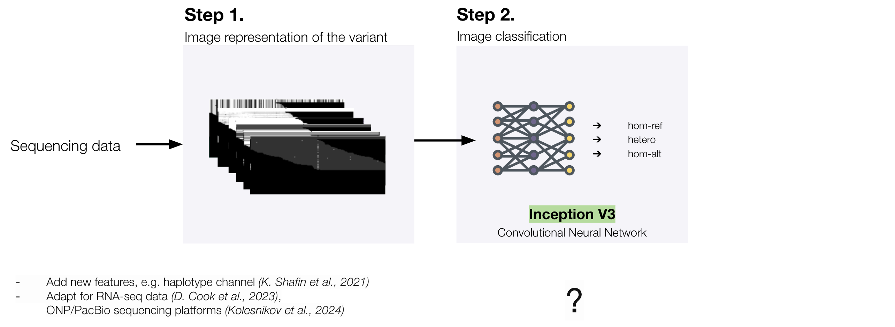
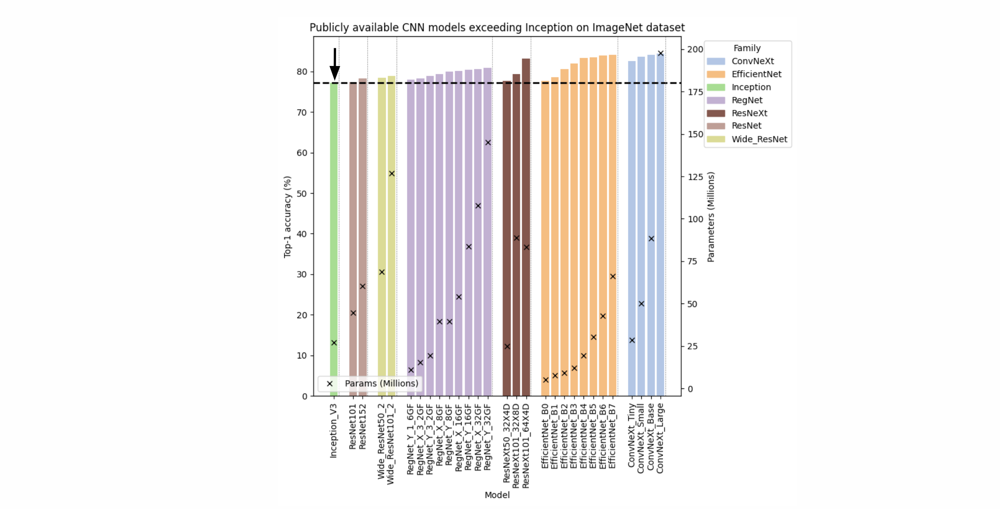

# Deep Learning Methods for Variant Calling from NGS Data

In this repository, we evaluate whether neural network architecture has a significant impact on predictive performance in the context of variant calling using DeepVariant framework.

## Project Overview

DeepVariant frames the task of variant identification as an image classification problem and works in two steps:
1. **Variant representation:** Sequencing data is transformed into images that encode nucleotides, alignment quality, and other relevant features.
2. **Classification:** Generated images are passed through a neural network (originally based on the Inception architecture) to classify them into one of three categories: homozygous alternate, heterozygous, and homozygous reference.

Commonly explored approaches to improve variant calling performance include increasing or modifying training data. However, to date, there has been no research exploring the role of neural network architectures on classification step. 



Since the release of Inception, newer architectures have already surpassed Inception in image classification tasks on public datasets. This led us to hypothesize that improving of variant calling accuracy could be achieved by modifying the architecture rather than solely focusing on the training data.



## Objective

Our main objective is to compare the performance of the original Inception model with alternative neural network architectures and test the hypothesis that modern architectures can lead to improved accuracy.

## Results

1. We have developed and tested a pipeline for model training. We observed that EfficientNet and RegNet show consistent improvements in accuracy and f1-score, primarily due to a notable improvement in precision. This indicates that performance is improved due to decreased false positive rate and enhances reliability of variant predictions, supporting its use in high-confidence calling scenarios.

2. Benchmark scores on real-world images do not guarantee real variant calling accuracy — ResNeXt model fall short, highlighting the importance of testing the accuracy in domain-specific tasks such as variant calling.

## Directory Structure

- `data/deepvariant/`: Contains PNG files and a CSV file (`data_subset_size.csv`) with metadata about the dataset (needed for image downloading in training.py).
- `docker/`: Includes a `Dockerfile` for creating environment.
- `experiments/`: Main directory - stores experiment configurations, results, and logs. Each experiment is organized by timestamp (e.g., `2025-W12-03-20`), containing:
  - `configs/`: files for training models (keep training and validation parameters).
  - `results/`: intermediate results for each architecture and experiment.
  - `tables/`: models statistics and summaries.
  - `tb/`: TensorBoard logs for visualizing training performance.
  - `training.py`: Script for training models.
- `notebooks/`: Jupyter notebooks for data analysis and visualization:
- `src/`: Contains the main source code including custom class for combining datasets with relevant number of channels.
  - `model.py`: Defines model architectures (models are downloaded from timm lib).
  - `transforms.py`: Data preprocessing and transforms.
  - `utils.py`: Utility functions.
- `requirements.txt`: Alternative way to create environment.

## Setup Instructions

### 1. Clone the repository:
```bash
git clone https://github.com/agurianova/rolling-in-the-deep.git
```
### 2. Create a virtual environment:
```bash
python -m venv venv
pip install -r requirements.txt
```
### 3. Build and run the Docker container:
If you prefer using Docker, you can follow these steps to build and run the container:

Build the Docker image:
```bash
cd docker
docker build -t your_image:0.1 .
```
Run the Docker container:
```bash
docker run --rm -itd --gpus '"device=0"' --cpus=32 --ipc=host \
  -v /path/to/rolling-in-the-deep/:/path/to/rolling-in-the-deep/ \
  -w /path/to/rolling-in-the-deep \
  -p 10000:10000 \
  your_image:0.1 bash
```
### 4. Run the experiment:
Once inside the container, run the training script with the desired configuration. For example, to run the experiment with the ResNeXt101-64x4d architecture, use:
```bash
python experiments/2025-W12-03-20/training.py --config experiments/2025-W12-03-20/configs/resnext101_64x4d_30000.yaml
```
This will start the training process for the selected model architecture with the specified configuration file.
