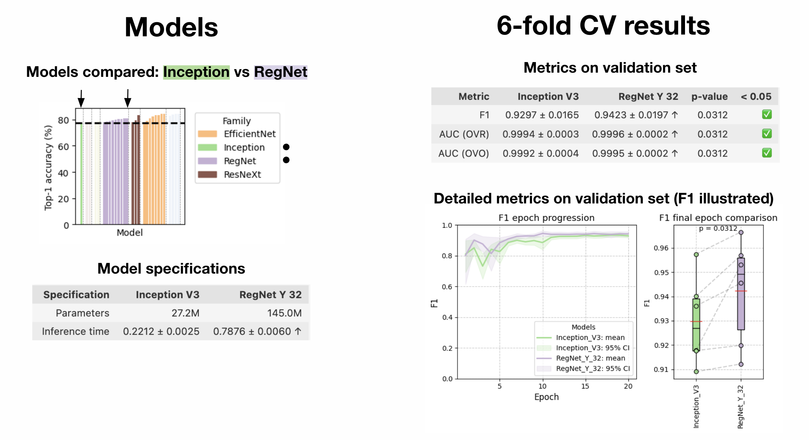

# DeepVariant baseline model replacement study

In this repository, we focus on improving the predictive performance of DeepVariant framework developed by Google for variant identification in genomic data. Our primary goal is to explore alternative neural network architectures and evaluate their performance to improve the accuracy of DeepVariant.

## Project Overview

DeepVariant frames the task of variant identification as an image classification problem and works in general terms in two steps:
1. **Image Generation**: The sequencing data is transformed into images that encode nucleotides, alignment quality, and other relevant parameters.
2. **Image Classification**: The generated images are passed through a neural network (originally based on the Inception architecture) to classify them into one of three categories: homozygous alternate, heterozygous, and homozygous reference.

Since the release of DeepVariant, Google has continuously expanded the training data to improve its accuracy. There are also studies that have improved accuracy by adding new features or retraining the model on new data (Step 1). However, to date, there has been no research exploring alternative architectures for the classification (Step 2). 


Since the release of Inception in 2017, newer architectures have already surpassed Inception in image classification tasks on well-known public datasets. This led us to hypothesize that improving DeepVariant’s accuracy could be achieved by modifying the architecture rather than solely focusing on increasing or altering the training data.


## Objective

Our main objective is to compare the performance of the original Inception model with alternative neural network architectures, to test the hypothesis that altering the network architecture can lead to improved accuracy.

## Interim Results

1. We have developed and tested a pipeline for model training on a dataset of 30,000 samples. We observed that RegNetY model shows consistent improvements in F1-score and AUC across all folds on variant images, with statistically significant results (p = 0.0312).



2. Benchmark scores do not guarantee real variant calling accuracy — models like ResNeXt and EfficientNet fall short, highlighting the importance of architecture and parameter count.
3. Follow-up analysis — motivated by these insights, we decided to include in analysis additional largest CNN ConvNeXt model (~200M parameters) to further explore how model scale influences variant calling performance.

## Directory Structure

- `data/deepvariant/`: Contains the genomic data files and a CSV file (`data_subset_size.csv`) with metadata about the dataset (needed for image downloading in training.py).
- `docker/`: Includes a `Dockerfile` for creating environment.
- `experiments/`: Main directory - stores experiment configurations, results, and logs. Each experiment is organized by timestamp (e.g., `2025-W12-03-20`), containing:
  - `configs/`: files for training models (keep training and validation parameters).
  - `results/`: intermediate results for each architecture and experiment.
  - `tables/`: models statistics and summaries.
  - `tb/`: TensorBoard logs for visualizing training performance.
  - `training.py`: Script for training models.
- `notebooks/`: Jupyter notebooks for data analysis and visualization:
- `src/`: Contains the main source code including custom class for combining datasets with relevant number of channels.
  - `model.py`: Defines model architectures (models are downloaded from timm lib).
  - `transforms.py`: Data preprocessing and transforms.
  - `utils.py`: Utility functions.
- `requirements.txt`: Alternative way to create environment.

## Setup Instructions

### 1. Clone the repository:
```bash
git clone https://github.com/agurianova/rolling-in-the-deep.git
```
### 2. Create a virtual environment:
```bash
python -m venv venv
pip install -r requirements.txt
```
### 3. Build and run the Docker container:
If you prefer using Docker, you can follow these steps to build and run the container:

Build the Docker image:
```bash
cd docker
docker build -t your_image:0.1 .
```
Run the Docker container:
```bash
docker run --rm -itd --gpus '"device=0"' --cpus=32 --ipc=host \
  -v /path/to/rolling-in-the-deep/:/path/to/rolling-in-the-deep/ \
  -w /path/to/rolling-in-the-deep \
  -p 10000:10000 \
  your_image:0.1 bash
```
### 4. Run the experiment:
Once inside the container, run the training script with the desired configuration. For example, to run the experiment with the ResNeXt101-64x4d architecture, use:
```bash
python experiments/2025-W12-03-20/training.py --config experiments/2025-W12-03-20/configs/resnext101_64x4d_30000.yaml
```
This will start the training process for the selected model architecture with the specified configuration file.
